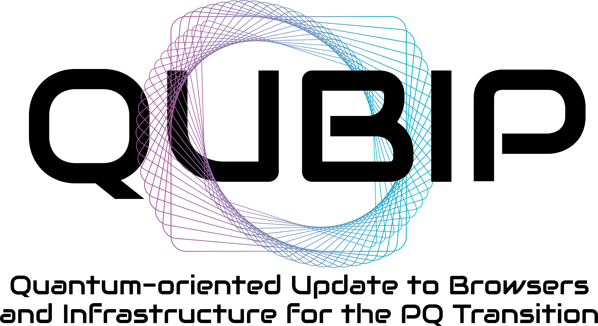

# QUBIP

### _Integrating PQC algorithms into protocols, networks, and systems_

QUBIP (_Quantum-oriented Update to Browsers and Infrastructure for the PQ Transition_) is a #HorizonEurope funded project addressing the challenge of transitioning protocols, networks and systems to Post-Quantum Cryptography (PQC).
